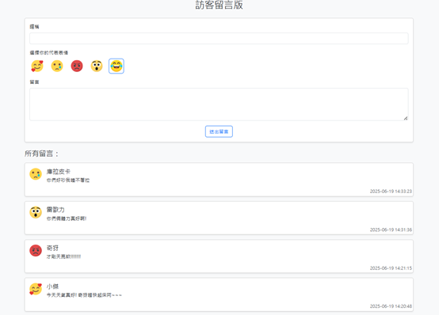

# PHP 訪客留言板專案

這是一個使用 **PHP + MySQL + Bootstrap** 製作的訪客留言板，支援使用者輸入暱稱、選擇代表表情圖示並留言。留言資料將儲存至 MySQL 資料庫，留言會即時顯示在下方留言牆。

## 專案畫面預覽




---

## 功能特色

- 使用者可填寫暱稱與留言內容
- 可選擇代表自己的表情圖示（使用自訂圖片）
- 所有留言即時顯示在下方，並標示留言時間
- 前端使用 Bootstrap 打造簡潔介面
- 後端使用 PDO 操作資料庫，避免 SQL Injection
- 表單欄位具備必填驗證
- 支援 emoji 圖示儲存與顯示

---

## 使用技術

| 類型 | 技術 |
|------|------|
| 前端 | HTML5, Bootstrap 5 |
| 後端 | PHP 8.x |
| 資料庫 | MySQL 5.x / 8.x |
| 開發環境 | XAMPP / VS Code |
| 資料安全 | htmlspecialchars + trim |

---

## 資料夾結構

```
guestbook/
│
├── emoji/ # 表情圖示資料夾
│ ├── smile.png
│ ├── cry.png
│ ├── angry.png
│ ├── wow.png
│ └── laugh.png
│
├── index.php # 主畫面與留言表單
├── save.php # 負責儲存留言資料
├── screenshot.png # 留言板畫面截圖（用於 README 顯示）
├── README.md # 專案說明文件
```

---

## 資料表建立語法（MySQL）

```sql
CREATE TABLE messages (
    id INT AUTO_INCREMENT PRIMARY KEY,
    name VARCHAR(100) NOT NULL,
    emoji VARCHAR(100) NOT NULL,
    message TEXT NOT NULL,
    created_at TIMESTAMP DEFAULT CURRENT_TIMESTAMP
) ENGINE=InnoDB DEFAULT CHARSET=utf8mb4;
